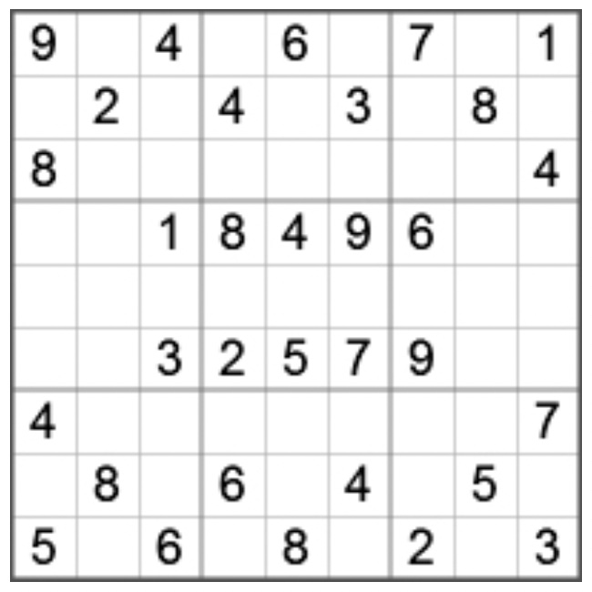

# sudoku-validator
Validator of sudoku puzzle 9x9 loaded from file

 

### Task:
Create a command line tool (running on jvm) for validating a standard 9x9 Sudoku puzzle:

**Command line:** validate.bat puzzleName.txt

**File format:** csv format each line representing a row e.g.:
 ``` 
 1,2,3,4,5,6,7,8,9 
 1,2,3,4,5,6,7,8,9 
 1,2,3,4,5,6,7,8,9
 1,2,3,4,5,6,7,8,9
 1,2,3,4,5,6,7,8,9
 1,2,3,4,5,6,7,8,9
 1,2,3,4,5,6,7,8,9
 1,2,3,4,5,6,7,8,9
 1,2,3,4,5,6,7,8,9
```

* The program should return 0 (VALID) or non-zero (INVALID) value with an error text on stdout (in case of an invalid solution or file).
* There should be unit tests covering a range of error conditions and the project should be maven or gradle based.
* It should be possible to unpack the code from a zip, generate test report, build it and use a batch file to call the code from a packaged jar.


## Thoughts during development

1. To create program programmer have to know how to solve sudoku 
2. According to task description we have to read data from file.
3. We have to check loaded data
   + number of elements
   + number of lines
   + only numbers separated with comma
   + numbers are from 1 to 9
4. In task there is no correct info about is this a solution or template that need to be solved. According to this case I think that space or no space between commas means any possible number that need to be solved.
5. There is no info about mandatory of filename input on application run. For easier testing decided to make `puzzleName.txt` as default filename.
6. We can build line using String.split() method but after that we have to go through any way... Plus when we have empty element at last position then split method doesn't accept it as element, and we have only 8 elements in a row as a result
7. 